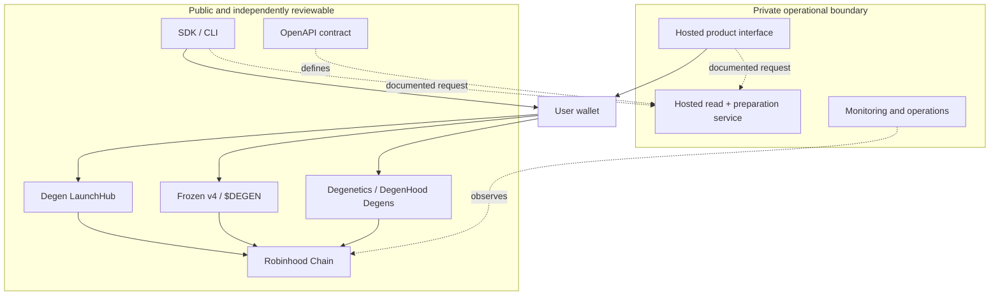

# Architecture

This document describes the public trust boundaries. It deliberately omits private service
implementation, operator procedures and autonomous launch infrastructure.

## Design principles

- **User-authorised:** wallets display and authorise state-changing transactions.
- **Verifiable:** public source, addresses and economic parameters can be checked independently.
- **Immutable where promised:** permanent liquidity and fee routes are enforced on chain.
- **Fail closed:** SDK/CLI verification rejects unexpected targets, value or calldata.
- **Separated authority:** operational services do not receive user keys and public tooling does not
  become a signer.

## System boundary

The private service may prepare and index information, but the wallet remains the transaction
authority. The public repository does not disclose or depend on the private service's internal
topology.

## Launch path

1. A creator chooses public token metadata and launch roles.
2. The client or SDK derives launch intent and requests any documented preparation data.
3. Public verification checks the network, target, zero value, predicted address and calldata.
4. The creator reviews and authorises the transaction in their wallet.
5. LaunchHub validates the request and deploys through an activated module.
6. Initial supply enters permanently locked liquidity according to the selected production template.
7. Subsequent fees accrue to immutable or role-controlled destinations described in public
   disclosures.

No public SDK or CLI code may accept a private key, seed phrase, signing callback or broadcast
credential.

## Contract families

### Degen LaunchHub

The production LaunchHub is the current token-launch surface. Public source includes the kernel,
activated launch modules, token implementation, LP lockers, fee lockers, buyback routes, interfaces,
libraries and the tests required to reproduce its reviewed behaviour.

### Frozen v4 and `$DEGEN`

The v4 factory, hook, LP locker, fee locker and protocol token are deployed and frozen. Their source
is published for verification. Change proposals must be treated as new security boundaries and
cannot alter already-deployed bytecode.

### Degenetics and DegenHood Degens

Degenetics is the backed-collection and activated-holder reward layer. Each Degen pack escrows a
fixed amount of `$DEGEN`; minting, activation, rerolls and redemption follow the published deployed
source. ETH and SPY reward lanes accrue by activation weight. The public project is assembled from
the exact Git blobs matched to each deployed contract because the production graph was compiled
from several source commits. See `docs/degenetics.md` for economics and authority boundaries.

## External dependencies

| Dependency | Trust assumption |
| --- | --- |
| Robinhood Chain | Ordering, execution, finality and RPC correctness |
| Uniswap contracts | Pool and liquidity-position behaviour at the pinned addresses |
| Quote assets | Token contract and issuer behaviour, where applicable |
| Wallets | Correct display and authorisation of user intent |
| RPC/indexing providers | Availability and read accuracy; critical reads should be independently checked |
| Block explorer | Convenience and source display, not the root of contract identity |

The exact production addresses and verification links belong in `docs/deployments.md`; moving branch
names or product labels are not sufficient identifiers.

## Data classification

| Class | Examples | Public repository |
| --- | --- | --- |
| Public | deployed LaunchHub, v4 and Degenetics source; addresses, ABIs, tests, OpenAPI | Included |
| Public-generated | build outputs, coverage, SBOM | Published only as signed release artefacts when useful |
| Internal | hosted product source, BFF source, monitoring, provider topology, operational limits | Excluded |
| Restricted | keys, credentials, wallet material, access lists, incident evidence | Never exported |

## Change flow

The private repository is canonical. An accepted public contribution is ported into canonical,
verified there, and later appears in a newly generated public snapshot. Direct public-to-private
merges are prohibited.
