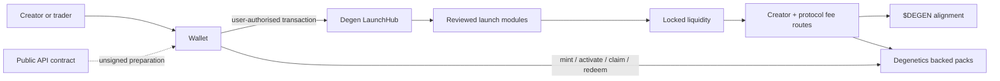

<div align="center">

# DegenHood

**Launch. Lock. Align.**

The verified public core for DegenHood on Robinhood Chain.

[Website](https://degenhood.fun) · [Explore](https://degenhood.fun/explore) ·
[Protocol](https://degenhood.fun/protocol) · [Documentation](docs/README.md) ·
[Security](SECURITY.md)

[](https://github.com/degenhood/DegenHood/actions/workflows/ci.yml)
[](https://github.com/degenhood/DegenHood/actions/workflows/codeql.yml)
[](https://robinhoodchain.blockscout.com)
[](LICENSING.md)

</div>

---

DegenHood is a token-launch and alignment protocol. Launches create their full fixed supply into
permanently locked liquidity. Trading fees are routed by immutable on-chain rules to creators,
protocol operations, buybacks, burns and holder-aligned rewards.

This repository exists for three things:

1. **Verify** the contracts, production addresses and economic rules.
2. **Build** against the public SDK, CLI and HTTP contract without trusting a hosted interface.
3. **Review** Degenetics and the protocol assumptions through a clear due-diligence record.

It contains no private keys, signing service, operator runbooks or autonomous launch infrastructure.

## Production at a glance

| Surface | Status | Reference |
| --- | --- | --- |
| Degen LaunchHub | Production | [`contracts-hub`](contracts-hub) |
| `$DEGEN` and frozen v4 stack | Production · frozen | [`contracts-v4`](contracts-v4) |
| Degenetics · DegenHood Degens | Production | [`contracts-degenetics`](contracts-degenetics) |
| SDK / CLI / OpenAPI `0.1.x` | Legacy v4-factory compatibility | [`packages`](packages) · [`openapi`](openapi) |

Always identify contracts by full address and chain ID—not by a name, symbol or screenshot. The
canonical production graph is maintained in [`docs/deployments.md`](docs/deployments.md) with
direct Blockscout links and a reconciliation block.

## How the system fits together



The released SDK and CLI prepare, verify and simulate unsigned **legacy v4-factory** launch intent.
They do not yet represent the current production LaunchHub path. They do not accept private keys,
sign, broadcast, deploy or move funds.

## Repository map

```text
contracts-hub/       LaunchHub and reviewed launch modules
contracts-v4/        Frozen $DEGEN / v4 protocol stack
contracts-degenetics/ Exact deployed Degenetics source and public tests
packages/sdk/        Unsigned preparation and verification SDK
packages/cli/        Terminal interface to the same safe workflow
openapi/             Public HTTP contract
examples/developer/  Minimal integrations
docs/                Architecture, economics, deployments and diligence
```

Start with:

- [`DUE_DILIGENCE.md`](DUE_DILIGENCE.md) for the evidence index and known limitations;
- [`ARCHITECTURE.md`](ARCHITECTURE.md) for trust boundaries and transaction paths;
- [`docs/deployments.md`](docs/deployments.md) for production identities;
- [`SECURITY.md`](SECURITY.md) before testing or reporting a vulnerability;
- [`AGENTS.md`](AGENTS.md) when using a coding agent in this repository.

## Verify locally

Prerequisites: Node.js 22 and Foundry 1.7.x.

```sh
npm ci --prefix packages/sdk
npm ci --prefix packages/cli

npm test --prefix packages/sdk
npm test --prefix packages/cli

(cd contracts-v4 && forge fmt --check && forge test)
(cd contracts-hub && forge fmt --check && forge test)
(cd contracts-degenetics && ./scripts/install-dependencies.sh && forge fmt --check && forge test)
```

The public CI runs exclusively from this repository. It must not depend on private files, private
submodules or secret-backed services.

## SDK and CLI compatibility

The `0.1.x` package line is retained for historical v4-factory integrations. Do not use it to
construct a new production LaunchHub launch. A future package will be described as current only when
its public compatibility record proves the production hub, domain, activated templates, request
commitment, predicted address and exact direct zero-value calldata.

Until then, use the hosted DegenHood interface for current LaunchHub launches and use the public
packages only for documented legacy/read-only workflows. See `COMPATIBILITY.md` before integrating.

## Security and change control

The deployed v4 source is frozen. Any proposed contract change requires a fresh security review and
is not a routine contribution. Report vulnerabilities privately through
[GitHub Security Advisories](SECURITY.md); never post a live exploit or credential in an issue.

## Licensing

First-party public code is MIT licensed and open to public pull requests. Documentation is licensed
separately under CC BY 4.0. DegenHood brand assets are not granted for reuse by either licence. Read
[`LICENSING.md`](LICENSING.md) before copying or modifying material.

`DegenHood`, `$DEGEN`, associated logos and character artwork are not licensed as trademarks by the
software licences. See [`TRADEMARKS.md`](TRADEMARKS.md).

## Risk notice

Smart contracts, tokens and liquidity positions involve substantial risk. Transactions are
irreversible and token prices may be highly volatile. Nothing in this repository is financial,
legal or investment advice. Review the source, on-chain state and current product disclosures before
interacting.
